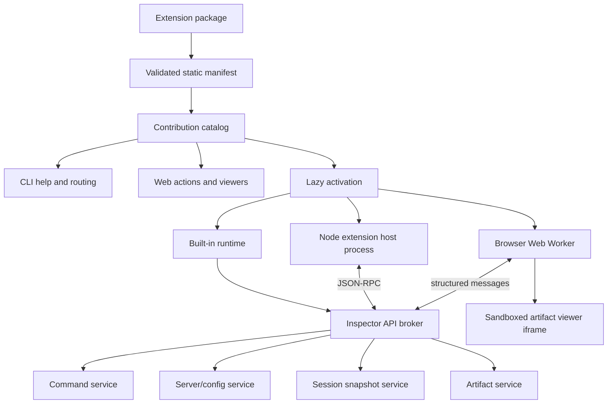

# Inspector extension architecture and implementation plan

## Status

- **Purpose:** design and implementation plan for an experimental fork
- **Maturity:** candidate architecture; public extension compatibility is not promised
- **Implemented:** Phase 0 contracts/static discovery, Phase 1 built-in command registry and CLI
  command lifecycle, and the Phase 2 artifact/native-session foundation
- **Primary targets:** CLI and Web; TUI consumes shared command and artifact services later
- **Reference model:** Visual Studio Code extensions (manifest, contribution points, lazy
  activation, runtime-specific entry points, and an extension-host boundary)

This plan introduces the extension seams through built-in examples before allowing arbitrary
third-party code. The examples are:

- `servers/list` and `servers/show` command contributions;
- a native Inspector session artifact;
- `mcpdesc-0.7` artifact export;
- the reserved `mcpdesc-0.8` identity, implemented only when that format is specified.

All implementation, schemas, examples, command names, and documentation added to the repository
are written in English.

## 1. Why this belongs in `specification/`

The repository distinguishes design/build specifications from task-oriented user guides:

- `specification/` owns architecture, contracts, alternatives, sequencing, and implementation
  plans. This document is the source of truth while the extension model is being designed and
  built.
- `docs/` owns user-facing guides for features that exist. Once sideloading is usable, add
  `docs/extensions/` with installation, trust, authoring, debugging, and packaging guides.
- client READMEs own surface-specific usage. The CLI README should eventually document command
  and artifact selection; the Web README should document extension management and artifact
  viewers.
- the root README should link the user guide once extensions are supported, but should not carry
  the protocol or host design.

Keeping the analysis and the normative design together avoids two documents drifting while the
architecture is still changing. If a decision later needs an independent history, record a short
ADR under `specification/decisions/` and link it from this document. Do not create an ADR for every
implementation detail.

Planned documentation set:

| Stage | Location | Audience | Contents |
| --- | --- | --- | --- |
| Design | `specification/v2_extension_architecture.md` | maintainers | contracts, security model, phases, rejected alternatives |
| First usable sideloading | `docs/extensions/README.md` | users | install, enable/disable, trust, inspect permissions |
| Author API available | `docs/extensions/authoring.md` | extension authors | manifest, contribution points, lifecycle, testing |
| CLI integration available | `clients/cli/README.md` | CLI users | command selection, artifact options, exit behavior |
| Web integration available | `clients/web/README.md` | Web users | extension management, export, artifact viewers |

The future user guides must describe only shipped behavior. They must not duplicate the candidate
contracts in this specification.

## 2. Goals and non-goals

### Goals

1. Add functionality without importing Inspector internals or publishing `core/`.
2. Use declarative manifests so contributions can be discovered without executing extension code.
3. Keep the host responsible for argument parsing, validation, server selection, connection,
   authentication, cancellation, output, redaction, and cleanup.
4. Support Node and browser runtimes through separate entry points and one serializable API.
5. Load extension code only when one of its contributions is invoked.
6. Make built-in and third-party contributions follow the same semantic contracts.
7. Preserve the current CLI syntax while replacing hard-coded short circuits with contribution-
  specific plans and executors.
8. Treat session files received in bug reports as untrusted data and open them without connecting
   to or launching a server.

### Non-goals for the first implementation

- A public marketplace, automatic updates, publisher verification, or revocation service.
- A secure Node.js sandbox. A child process is a fault boundary, not a permission boundary.
- Arbitrary React or Mantine component injection into the Inspector application tree.
- Publishing the existing `core/` tree as an extension SDK.
- Stabilizing transport, interceptor, or arbitrary panel APIs before those surfaces are understood.
- Implementing or guessing the future MCP Description 0.8 schema.
- Replacing MCP methods with extension commands. MCP operations remain protocol operations.

## 3. Terminology

- **Extension:** a versioned package with a manifest and optional Node/browser entry points.
- **Contribution point:** a typed capability declared by an extension, such as a command or
  artifact format.
- **Command:** an Inspector operation selected by the user. It may require no server, a resolved
  server configuration, or a connected server.
- **Artifact format:** a versioned persisted representation that an extension can produce, consume,
  validate, or render.
- **Host:** the Inspector surface coordinating extensions, resources, trust, and lifecycle.
- **Extension host:** the runtime that executes extension code and brokers calls to the Inspector
  API.
- **Native session artifact:** the Inspector-owned lossless, redacted JSON representation used for
  record, replay, share, and audit transcript work.
- **Provider:** the runtime implementation registered for a declared contribution.

Use namespaced identifiers. Human-facing aliases may be shorter, but persisted identifiers are
never bare names such as `dump` or `list`.

## 4. Candidate architecture



The design deliberately separates four layers:

1. **Manifest and contribution catalog:** pure, isomorphic, no extension execution.
2. **Contribution planning:** host-owned validation of command or artifact requirements and options.
3. **Extension runtime:** built-in activation, Node child process, or browser worker.
4. **Brokered API:** serializable operations instead of references to `InspectorClient`, stores,
   Commander, React, or the filesystem.

## 5. Manifest

The external package manifest should be `inspector-extension.json`. During the built-in phase, the
same shape may be represented by typed constants so bundlers include the implementations
deterministically. A packaging phase later emits and validates the JSON form.

Illustrative manifest:

```json
{
  "id": "example.mcpdesc",
  "displayName": "MCP Description",
  "version": "1.0.0",
  "engines": {
    "inspector": ">=2.2.0",
    "extensionApi": "^0.1.0"
  },
  "entrypoints": {
    "node": "./dist/node/extension.js",
    "browser": "./dist/browser/extension.js"
  },
  "activationEvents": [
    "onArtifactExport:example.mcpdesc-0.7"
  ],
  "capabilities": {
    "serverData": "read",
    "sessionData": "none",
    "filesystem": "output-only",
    "network": false,
    "processExecution": false,
    "secrets": false
  },
  "contributes": {
    "artifactFormats": [
      {
        "id": "example.mcpdesc-0.7",
        "mediaTypes": [
          "application/json",
          "application/yaml"
        ],
        "encodings": [
          "json",
          "yaml"
        ],
        "operations": [
          "export",
          "validate"
        ],
        "dataRequirements": {
          "serverDescription": "read",
          "session": "none"
        }
      }
    ]
  }
}
```

### Manifest rules

- `id` is globally unique and follows `<publisher>.<name>`.
- contribution IDs are globally unique and normally start with the extension ID.
- extension package version and artifact format version are independent.
- `engines.extensionApi` gates the brokered API contract; it does not expose the Inspector package
  version as an API.
- paths are relative, remain inside the package, and are validated before activation.
- options use a supported JSON Schema subset and are validated by the host.
- manifests declare requested capabilities. They do not grant them.
- a declared contribution must have an implementation. Planned formats are documented, not
  advertised as available.

The manifest schema and runtime validator belong in shared isomorphic code. Invalid, duplicate, or
incompatible manifests fail before any entry point is loaded.

## 6. Contribution points

Start with only two contribution families.

### 6.1 Commands

A command declares its resource requirements and option schema:

```ts
type ConnectionRequirement = "none" | "resolved" | "connected";

type ServerSelectionRequirement = "none" | "all" | "exactly-one";

interface CommandContribution {
  id: string;
  aliases?: string[];
  title: string;
  connection: ConnectionRequirement;
  serverSelection: ServerSelectionRequirement;
  optionsSchema?: JsonObject;
}
```

Illustrative built-ins:

| Contribution ID | Alias | Selection | Connection |
| --- | --- | --- | --- |
| `modelcontextprotocol.servers.list` | `servers/list` | all | none |
| `modelcontextprotocol.servers.show` | `servers/show` | exactly one | resolved |
| `modelcontextprotocol.mcp.invoke` | `mcp/invoke`; current `--method` flow | exactly one | connected |
| `modelcontextprotocol.artifacts.export` | selected by artifact export flags | exactly one | varies by artifact provider |

`servers/list` and `servers/show` stop being parser short circuits. They produce ordinary execution
plans whose declared requirements cause the host to skip authentication and connection. The
existing redaction behavior remains mandatory.

### 6.2 Artifact formats

Artifact formats declare operations separately from serialization encodings:

```ts
type ArtifactOperation = "export" | "import" | "validate" | "view";

interface ArtifactFormatContribution {
  id: string;
  displayName: string;
  artifactVersion: string;
  mediaTypes: string[];
  encodings: string[];
  operations: ArtifactOperation[];
  optionsSchema?: JsonObject;
  dataRequirements: ArtifactDataRequirements;
}
```

`ArtifactDataRequirements` explicitly declares independent read access to the stable server
description snapshot and native session snapshot:

```ts
interface ArtifactDataRequirements {
  serverDescription: "none" | "read";
  session: "none" | "read";
}
```

JSON and YAML are encodings, not artifact types. `mcpdesc-0.7` and the native Inspector session
are different artifact formats. An extension package may contribute more than one format version,
but each version has its own immutable contribution ID.

Future contribution families (`artifactViewers`, `transports`, `interceptors`, `sessionAnalyzers`,
and `panels`) remain proposed until at least two real built-in consumers establish their shape.

## 7. Host-owned options and CLI routing

The extension does not take unrestricted ownership of `argv`. The host performs a bootstrap parse,
resolves a declared contribution, adds the contribution's schema-defined options, and returns a
validated object to the provider.

Candidate syntax:

```text
mcp-inspector --cli --command servers/list --catalog ./mcp.json
mcp-inspector --cli --command servers/show --server example --catalog ./mcp.json
mcp-inspector --cli --command mcp/invoke --method tools/list node server.js
mcp-inspector --cli --artifact-plugin mcpdesc-0.7 --encoding yaml --output server.yaml ...
mcp-inspector --cli --artifact-plugin inspector-session --output session.json ...
```

Compatibility behavior:

- current protocol invocations using `--method` continue to select the built-in MCP invocation
  command;
- `--method servers/list` and `--method servers/show` remain compatibility aliases initially, but
  route through the command registry rather than special parser branches;
- the launcher needs no new parsing because it already forwards client arguments unchanged;
- unknown extension options are rejected after contribution selection instead of being silently
  accepted;
- `--` keeps its existing server-target meaning and is not repurposed as the primary extension
  argument mechanism.

Shared host option groups include server source, server selection, connection/authentication,
artifact encoding, and output sink. Extensions cannot redefine these names. Extension-specific
options are namespaced in the manifest and delivered as a validated JSON-compatible object.

## 8. Contribution plans

Each contribution family owns an explicit planning and execution lifecycle. Command and artifact
plans remain separate because they carry different requirements: commands select servers and
connections, while artifact plans keep format, operation, encoding, version, and output distinct.
The shared lifecycle is **bootstrap → plan → execute**.

Command parsing yields a declarative plan instead of executing catalog or authentication work:

```ts
interface CommandPlan {
  kind: "command";
  commandId: string;
  extensionId: string;
  serverSource: ServerSourceOptions;
  serverSelection: ServerSelectionRequirement;
  connection: ConnectionRequirement;
  options: JsonObject;
  output: OutputOptions;
}
```

The CLI adds a discriminated host-plan union around this shared DTO. The two pre-existing utilities
remain host-owned operations rather than pretending to be extension contributions:

```ts
type CliHostPlan =
  | { kind: "host"; operation: "list-stored-auth"; oauthStatePath: string }
  | {
      kind: "host";
      operation: "print-handoff";
      oauthStatePath: string;
      serverUrl: string;
      transport?: "sse" | "http" | "stdio";
    };
```

Host utility plans remain outside `extensions/commands`; they are CLI operations, not extension
contributions.

Command planning is side-effect-free with respect to catalogs, OAuth state, and transports. It resolves a
canonical contribution from static metadata and copies that contribution's selection/connection
requirements into the plan. Dispatch keys off those requirements: `none` runs `servers/list`,
`resolved` runs `servers/show`, and only `connected` enters client configuration, OAuth, transport,
and MCP invocation setup.

The runner applies the plan in this order:

1. validate manifest compatibility and requested contribution;
2. validate global and contribution-specific options;
3. check trust and granted capabilities;
4. load and select server configurations as declared;
5. prepare authentication only when a connection is required;
6. establish the MCP connection only when required;
7. activate the extension lazily;
8. invoke the provider with cancellation and timeout support;
9. validate the result envelope;
10. write through a host-owned output sink;
11. disconnect and deactivate as appropriate.

This replaces the former binary `ParseResult` distinction between a connected invocation and a
`shortCircuit` with explicit command and host plans. Phase 2 adds a sibling artifact plan/executor
rather than widening `CommandPlan` into a generic catch-all.

## 9. Brokered extension API

Extensions never receive an `InspectorClient`, state store, OAuth provider, Commander program,
React component, DOM node, or unrestricted output stream. The initial API is deliberately small:

```ts
interface InspectorExtensionApi {
  readonly apiVersion: string;
  commands: CommandRegistrationApi;
  artifacts: ArtifactRegistrationApi;
  servers: ServerReadApi;
  sessions: SessionReadApi;
  output: OutputApi;
  diagnostics: DiagnosticsApi;
}
```

Every input and output crossing the extension-host boundary must be JSON-compatible or binary data
with an explicit media type. Dates use ISO-8601 strings. Errors use a stable error envelope. Large
session sections should be paged or streamed rather than copied as one unbounded RPC value.

### Server description API

The MCP Description exporter needs a stable aggregate, not direct SDK objects:

```ts
interface ServerDescriptionSnapshot {
  capturedAt: string;
  protocolVersion?: string;
  protocolEra?: "legacy" | "modern";
  serverInfo?: JsonObject;
  capabilities?: JsonObject;
  instructions?: string;
  tools: JsonObject[];
  resources: JsonObject[];
  resourceTemplates: JsonObject[];
  prompts: JsonObject[];
  diagnostics: ArtifactDiagnostic[];
}
```

The host creates this DTO using capability-gated parallel list operations with cache bypass. It
excludes tools the Inspector already considers invalid and emits diagnostics describing each
exclusion. The extension maps only this DTO to its external format.

### Session API

Session export cannot be implemented solely from `InspectorClient`: protocol, network, console,
stderr, server configuration, and UI-managed state currently have different owners. Each surface
must implement a `SessionSnapshotSource` adapter that feeds one shared snapshot builder.

The native artifact builder must not reach into React stores or private fields. This boundary is
also what makes replay possible without a live client.

## 10. Built-in examples

### 10.1 `servers/list`

The contribution demonstrates a command requiring configuration I/O but no server selection,
authentication, or MCP connection.

- move reusable list/show DTOs and redaction into shared Node code;
- retain an empty in-memory secret store for list operations;
- preserve deterministic name sorting;
- produce output through the existing text/JSON formatter;
- verify that no transport or OAuth operation is attempted.

### 10.2 `servers/show`

The contribution demonstrates one resolved configuration without connection.

- require exactly one server name;
- preserve redaction of environment values, authorization/cookie/token headers, metadata, and
  OAuth client secrets;
- never expose a rehydrated secret through the extension API;
- support the same catalog/config/ad-hoc conflict rules as the host.

### 10.3 Native Inspector session artifact

Canonical ID: `modelcontextprotocol.inspector-session-1`.

The initial artifact is JSON only and must contain enough information to reopen the session with no
server running:

```text
header
├── format id and version
├── Inspector version
├── captured-at timestamp
└── session identity
server
├── redacted source configuration
├── negotiated protocol version and era
├── server implementation and instructions
└── client/server capabilities
discovery
├── tools and exclusion diagnostics
├── resources
├── resource templates
└── prompts
events
├── protocol messages and pairing/duration metadata
├── network/fetch entries
├── stderr and server logs
├── console entries
└── task/subscription/auth events available to the host
attachments
└── reserved references for large external payloads
```

Security requirements:

- redact secrets by default before serialization;
- record redaction diagnostics without recording the removed values;
- opening the file never reconnects, launches stdio, refreshes OAuth, fetches URLs, or loads remote
  resources;
- replay reads the artifact document model and feeds read-only stores;
- unknown fields survive read/write migration where practical;
- every format change increments the artifact format version independently of the Inspector app.

The native artifact is the shared basis for session record/replay/share and the structured audit
transcript described in the roadmap. OTLP is a projection of this artifact, not a second recorder.

### 10.4 MCP Description 0.7

Canonical ID: `modelcontextprotocol.mcpdesc-0.7`.

The provider:

1. requests a fresh `ServerDescriptionSnapshot` from the host;
2. projects SDK/Inspector DTOs through a version-specific allowlist;
3. never copies unknown SDK fields blindly into the artifact;
4. validates the projected document against the authoritative MCP Description 0.7 schema with
   AJV;
5. emits JSON or YAML through the host output sink;
6. returns diagnostics for excluded invalid tools and unsupported source fields;
7. fails before writing when validation fails.

The schema and mapping are version-specific modules. A shared collector is allowed; a shared
"latest mcpdesc" mapper is not.

### 10.5 MCP Description 0.8

Reserved canonical ID: `modelcontextprotocol.mcpdesc-0.8`.

Do not register this contribution until an authoritative 0.8 schema exists. During architecture
development, a manifest fixture may use the ID to test unavailable/incompatible contribution
diagnostics, but production discovery must not claim that export is supported.

When 0.8 is available:

- add a separate schema, mapper, fixtures, and compatibility tests;
- keep the 0.7 provider unchanged;
- share collection only where the source requirements are identical;
- allow the extension package version to evolve without changing either artifact ID.

## 11. Runtime and security model

### Built-in runtime

Built-ins are statically registered and bundled. They use the same provider interfaces and result
validation as external extensions, but do not pay a process boundary initially. This phase proves
the contracts, not the isolation mechanism.

### Node extension host

External Node extensions run in a child process and communicate over framed JSON-RPC. Prefer one
process per extension for the first implementation. The host owns:

- startup and activation timeout;
- invocation timeout and cancellation;
- stdout/stderr capture without corrupting CLI output;
- crash reporting and restart policy;
- message size limits;
- API method allowlisting and payload validation;
- graceful deactivate followed by forced termination.

A child process is not a security sandbox. Unless OS sandboxing is added, Node extensions can read
files, make network requests, and launch processes under the user's identity. Capability
declarations therefore support informed consent and broker behavior but cannot truthfully claim to
prevent direct Node access.

Initial external loading must be explicit, local, and disabled by default. The user trusts an exact
path and package digest. There is no automatic update.

### Browser runtime and viewers

Browser logic runs in a dedicated Web Worker with a bundled browser entry point. Complex UI runs in
a sandboxed iframe on the existing separate sandbox origin and communicates with validated
`postMessage` envelopes.

An extension never injects React components into the application tree. Viewer requirements:

- strict Content Security Policy;
- no parent DOM access;
- minimum sandbox permissions;
- no implicit network access;
- host-brokered artifact reads and downloads;
- explicit disposal and cancellation;
- theme, high-contrast, reduced-motion, and accessibility metadata supplied by the host.

### Trust modes

Model trust independently for extension code, session artifacts, and server configurations:

| Operation | Untrusted artifact/config | Trusted |
| --- | --- | --- |
| Parse and validate a session artifact | allowed | allowed |
| Render native read-only session views | allowed | allowed |
| Export a pure projection | allowed when no secrets are requested | allowed |
| Reconnect recorded server config | denied | explicit action |
| Launch recorded stdio command | denied | explicit action |
| Activate external Node extension | denied | explicit extension trust |
| Load remote viewer resources | denied | denied by default |

## 12. Proposed source layout

Avoid a new top-level TypeScript tree in the first phases: repository typecheck, format, packaging,
and coverage gates are deny-by-default or whitelist-based. Put shared implementation under the
already-gated `core/` surface and client adapters under their existing clients.

```text
core/extensions/
├── api/
│   ├── artifacts.ts
│   ├── commands.ts
│   ├── diagnostics.ts
│   ├── json.ts
│   └── sessions.ts                 # native v1 schema, bounded parser, serializer
├── commands/
│   └── plan.ts                     # shared command-plan DTO
├── manifest/
│   ├── schema.ts
│   ├── parse.ts
│   └── compatibility.ts
├── registry/
│   ├── contributionRegistry.ts
│   └── activationRegistry.ts       # Later activation phase
├── artifacts/
│   ├── plan.ts                     # shared artifact-plan DTO
│   ├── service.ts                  # provider registry + host-owned output dispatch
│   └── serverDescriptionSnapshot.ts # Phase 3
├── builtin/
│   ├── manifests.ts
│   ├── catalog.ts
│   ├── servers/
│   │   └── catalog.ts              # Phase 1 Node catalog providers/redaction
│   ├── inspector-session/
│   │   ├── snapshot.ts             # shared builder + redaction policy
│   │   └── provider.ts             # native JSON export/validation provider
│   └── mcpdesc-0.7/                # Phase 3
└── node/
  ├── extensionHost.ts            # Phase 4
  ├── extensionProcess.ts         # Phase 4
  └── rpc.ts                      # Phase 4

clients/cli/src/extensions/
├── bootstrap.ts                    # static built-in catalog + selector resolution
├── commands/
│   ├── plan.ts                     # CLI command planning
│   └── execute.ts                  # requirement-driven command execution
└── artifacts/                      # Phase 2
  ├── plan.ts
  └── execute.ts

clients/cli/src/host/
└── plan.ts                         # non-extension CLI utility plans

clients/web/src/lib/extensions/
├── extensionCatalog.ts
├── sessionSnapshotSource.ts
├── browserExtensionHost.ts
└── artifactDownload.ts

clients/web/src/components/extensions/
├── ArtifactExportAction.tsx
└── ExtensionViewerFrame.tsx
```

Exact files should be introduced only in the phase that uses them. Do not create empty framework
directories.

Dynamic option-schema wiring is intentionally deferred until a phase introduces contributions that
declare extension-specific options; Phase 1 has only host-owned options.

If truly external packages are added later, place development fixtures under a dedicated
`extensions/fixtures/` tree only after updating:

- root package publishing/build rules;
- format and typecheck coverage verification;
- lint configuration;
- test and coverage projects;
- repository structure documentation.

## 13. Implementation phases

### Phase 0 — Contract spike and fixtures

Deliverables:

- manifest schema and parser;
- typed command and artifact contribution DTOs;
- compatibility and duplicate-ID diagnostics;
- static built-in registry;
- fixture manifests for valid, invalid, incompatible, Node-only, browser-only, and planned 0.8
  cases.

Exit criteria:

- manifests are discoverable without importing extension code;
- malformed contributions fail deterministically;
- no public package or dynamic code loading exists.

### Phase 1 — Command registry and CLI command lifecycle

**Status: implemented.** The static registry contains `modelcontextprotocol.mcp.invoke`,
`modelcontextprotocol.servers.list`, and `modelcontextprotocol.servers.show`; the CLI accepts each
canonical ID and short alias while preserving all `--method` forms and host utility precedence.

Deliverables:

- replace `ParseResult.shortCircuit` with explicit command and host plans;
- register MCP invocation, `servers/list`, and `servers/show` as built-in commands;
- move reusable server list/show and redaction behavior into shared Node code;
- preserve all existing CLI forms and exit/output behavior;
- add explicit `--command` selection while retaining compatibility aliases.

Exit criteria:

- `servers/list` and `servers/show` contain no parser-specific branch;
- tests prove that catalog commands never initialize OAuth or a transport;
- existing CLI tests remain green.

### Phase 2 — Artifact service and native session format

**Status: foundation implemented.** The static catalog now advertises
`modelcontextprotocol.inspector-session-1` for JSON export and validation. Shared code provides
artifact plan/provider/output-sink contracts, a v1 native schema, a bounded untrusted parser, a
snapshot builder, and centralized recursive redaction. The builder accepts only serializable DTOs
from surface-specific adapters; it does not reach into clients, stores, React, or transports.

The parser rejects malformed JSON, artifacts above the host limit, other format IDs, and unsupported
versions before replay. Same-version unknown JSON fields survive parse/serialize round trips. The
native provider never writes directly to stdout or the filesystem: validated payloads flow through
a host-owned output sink.

Still to implement in this phase are the CLI/Web snapshot-source adapters, CLI artifact routing,
Web download action, and read-only import/replay stores. Until those adapters exist, the registered
provider is an internal built-in contract and no new user-facing export flag is claimed.

Deliverables:

- artifact provider registration and output sinks;
- native session schema/version and redaction policy;
- shared snapshot builder;
- CLI snapshot adapter for the current connected invocation;
- Web snapshot adapter over protocol/network/log/config state;
- Web JSON download action;
- read-only import and replay model with no server dependency.

Exit criteria:

- record and reopen a session on another machine with no server running;
- round-trip tests preserve supported fields;
- secret canaries never appear in serialized output;
- corrupt, oversized, and future-version artifacts fail safely.

### Phase 3 — `mcpdesc-0.7`

Deliverables:

- fresh server-description collector;
- capability-gated parallel lists with cache bypass;
- version-specific 0.7 schema and allowlist mapper;
- AJV validation;
- JSON and YAML encoders;
- CLI output/file support and Web download support;
- fixtures for complete, partial-capability, paginated, and invalid-tool servers.

Exit criteria:

- every emitted artifact validates against the authoritative 0.7 schema;
- unsupported capabilities do not trigger invalid list calls;
- excluded tools produce diagnostics but not invalid output;
- stdout remains machine-clean in structured mode.

### Phase 4 — External Node extension host

Deliverables:

- explicit local-path sideloading;
- child-process lifecycle and framed JSON-RPC;
- brokered API with schema validation in both directions;
- trust prompt/configuration, package digest, enable/disable state;
- activation/invocation timeouts, cancellation, crash diagnostics, and log isolation;
- one sample external artifact extension using only the published contract.

Exit criteria:

- extension crashes cannot crash the Inspector process;
- extension stdout cannot corrupt CLI artifacts;
- untrusted extensions never activate;
- API compatibility errors are actionable.

### Phase 5 — Browser runtime and viewer

Deliverables:

- browser entrypoint loading in a Web Worker;
- sandboxed viewer iframe and message schemas;
- read-only native session viewer integration;
- browser capability/trust checks;
- extension lifecycle and browser smoke coverage.

Exit criteria:

- a browser extension can validate/project an artifact without Node APIs;
- a viewer cannot access parent DOM or unrestricted local resources;
- first-party UI remains presentational and receives extension state through props.

### Phase 6 — API stabilization and packaging

Deliverables:

- extract only DTO types and schemas into a small extension API package if external authoring has
  proved useful;
- stable/proposed API distinction;
- authoring and migration guides;
- deterministic extension archive format;
- decision on registry/marketplace scope.

Do not publish `core/`. A future extension API package contains contracts and generated validators,
not Inspector runtime implementations.

### Phase 7 — MCP Description 0.8

Trigger: an authoritative 0.8 specification and schema exist.

Deliverables:

- activate the reserved `modelcontextprotocol.mcpdesc-0.8` contribution;
- independent schema, mapper, fixtures, and tests;
- migration/difference documentation from 0.7;
- no behavior change in `mcpdesc-0.7`.

## 14. Testing and repository gates

All new or modified code must clear the repository's per-file 90% gate on lines, statements,
functions, and branches.

Test placement:

- shared `core/extensions/**` tests live under `clients/web/src/test/core/extensions/**`, mirroring
  the source layout;
- Web-owned components, hooks, and `lib` modules use side-by-side tests;
- all CLI tests live under `clients/cli/__tests__/`;
- future launcher/TUI tests stay in their top-level `__tests__/` directories;
- Node extension-host integration tests exercise real child processes and cleanup;
- Web viewer tests render through `renderWithMantine`; sandbox behavior also needs a browser smoke
  or Storybook play test where unit DOM emulation is insufficient.

Required test groups:

1. manifest/schema/compatibility table tests;
2. contribution collision and activation lifecycle tests;
3. command-plan tests for every connection/selection requirement;
4. redaction canary and hostile-input tests;
5. native session round-trip and migration tests;
6. MCP Description schema conformance and partial-capability tests;
7. extension process crash, timeout, malformed RPC, output isolation, and cleanup tests;
8. browser CSP/message validation and disposal tests;
9. package verification proving required built assets ship.

Run the fast client validations during development. Before committing, run the root formatter;
before pushing, run the complete root CI command as required by repository policy.

## 15. Documentation milestones

Documentation changes are deliverables, not cleanup:

- Phase 0 updates this specification as contracts change.
- Phase 1 updates the CLI README for `--command` and compatibility aliases.
- Phase 2 adds the session artifact schema reference and record/replay user guide.
- Phase 3 documents MCP Description versions, freshness, excluded-tool diagnostics, JSON/YAML, and
  examples.
- Phase 4 creates `docs/extensions/README.md` and `docs/extensions/authoring.md`.
- Phase 5 adds browser/viewer security and accessibility guidance.
- Phase 6 marks each API as stable or proposed and defines compatibility policy.
- every phase updates the root or relevant client README when files, commands, dependencies, or
  architectural patterns change.

## 16. Risks and mitigations

| Risk | Mitigation |
| --- | --- |
| Public API freezes too early | built-ins first; proposed API; publish contracts only after external sample succeeds |
| Node process mistaken for a sandbox | explicit trust language; no security claims; consider OS sandboxing separately |
| Plugins depend on Inspector internals | brokered DTO API; no `core/`, SDK object, store, or React references |
| CLI compatibility regression | command plans behind existing syntax; broad current-test preservation |
| Session leaks credentials | centralized redaction, canary tests, no implicit secret capability |
| Session artifact becomes an executable config | read-only open by default; explicit trust before reconnect/launch |
| Browser plugin compromises UI | worker logic, sandboxed iframe, CSP, validated messages, no React injection |
| Format versions drift together | immutable contribution IDs and independent mappers/schemas |
| 0.8 is guessed prematurely | reserve/document ID only; do not advertise until authoritative |
| New source falls outside gates/package | remain under existing gated trees initially; extend verification before new top-level tree |

## 17. Decisions still required

1. Exact session artifact schema, attachment strategy, maximum sizes, and migration policy.
2. **Resolved for Phase 1:** use `--command` with short or canonical selectors; retain `--method`
  compatibility aliases and do not add a subcommand namespace yet.
3. Whether `--artifact-plugin` remains the public spelling or becomes `--artifact-format` before
   release. The manifest model supports either without changing provider contracts.
4. Which server fields the broker exposes to artifact providers and which always remain host-only.
5. Whether external Node extensions are acceptable without OS sandboxing in the fork.
6. How extension trust and enablement are persisted per user versus per catalog/workspace.
7. Whether external extension packages use a custom archive immediately or a constrained npm
   package during development.
8. Which APIs, if any, TUI exposes beyond shared commands and artifacts.

## 18. Recommended next implementation slice

Phase 0 and Phase 1 now validate static discovery, canonical/short command selection,
no-connection commands, and connected MCP invocation. The next independent slice is Phase 2's
native artifact contract and one minimal session export; it must not pull in external loading, the
browser host, or MCP Description mapping prematurely.

Do not combine the child-process host, browser viewer, session schema, and MCP Description exporter
in one change. Each introduces a different compatibility and security boundary and needs an
independent review.
